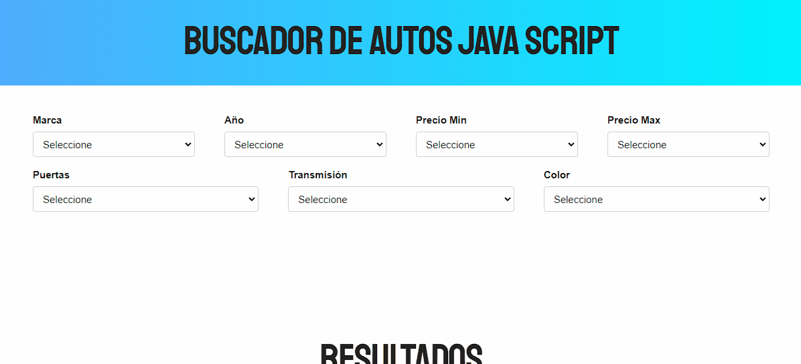

<h1 align="center">🌟 Project: Car Searcher 🎨</h1>

<h3 align="center">📝 App to filter cars by brand and model and show the results 
</h3>

 

## <h3>📄 **Description:**</h3>

> This project was created using the technologies HTML, SKELETON CSS, JAVASCRIPT, CSS3, and it is a project that allows you to filter cars by brand and model and show the results using high level functions and functional programming.

 

## <h3>🚀 **:: Deploy link ::**</h3>

> 🌎 [https://buscardor-carros.netlify.app](https://buscardor-carros.netlify.app 'Deployment Link')

 

## <h3>📄 **:: Preview ::**</h3>

 

## <h3>📄 **:: Technologies used and resources used ::**</h3>

       
      
      

 

-   [HTML](https://developer.mozilla.org/es/docs/Web/HTML 'HTML')
-   [SKELETONCSS](https://skeleton-framework.github.io/ 'SKELETONCSS')
-   [JAVASCRIPT](https://developer.mozilla.org/es/docs/Web/JavaScript 'JAVASCRIPT')

 

## <h3>🤖 **:: Aviable Commands ::**</h3>

      no commands aviable

 

## <h3>⚙️ **:: How to start ::**</h3>

-   Clone the repository in your computer.
-   Navigate to the root folder of the project.
-   Open the index.html file in your browser.
-   Enjoy! 🎉

 

## <h3>🤝 **:: How to contribute ::**</h3>

If you would like to contribute to this project, we would love to receive your contributions! You can help in the following ways:

-   Correcting errors in the code.
-   Adding new features to the project.
-   Improving existing documentation.
-   Sharing your ideas and suggestions in the "Issues" section of the project.
-   Thank you for your interest in this project! 🎉

 

## <h3>🤝 **:: Developed by ::**</h3>

> 🌎 [Racknar0](https://github.com/Racknar0 'Deployment Link')
